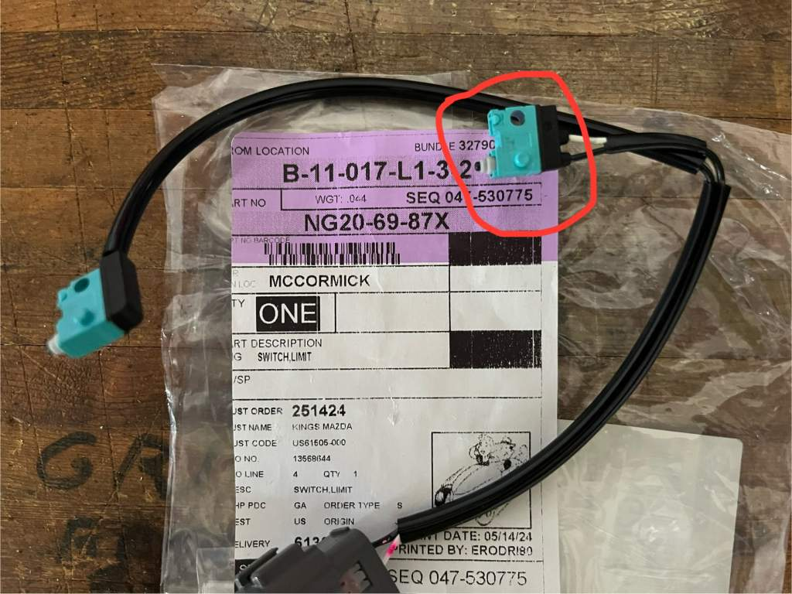
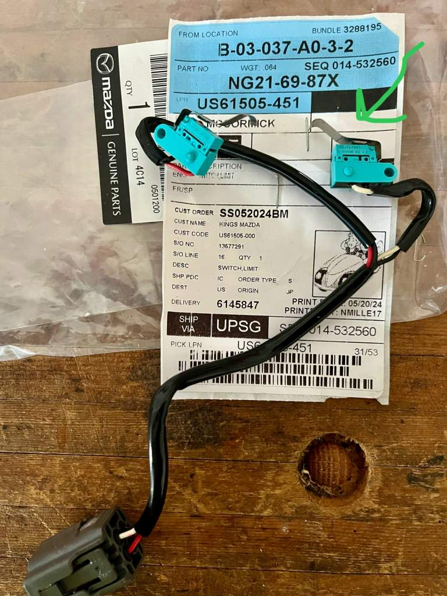

## Концевики крыши

__Mazda__ `NG206987X` *правый?*

__Mazda__ `NG216987X` *левый?*

__Panasonic__ `ASQ10230`

__Panasonic__ `ABJ363840`

__Panasonic__ `ABJ363860`

__Panasonic__ `ABJ362860` (нормально разомкнутый, цвет проводов - красный и чёрный)

__Panasonic__ `ABJ363861` (нормально замкнутый, цвет проводов - белый и чёрный)