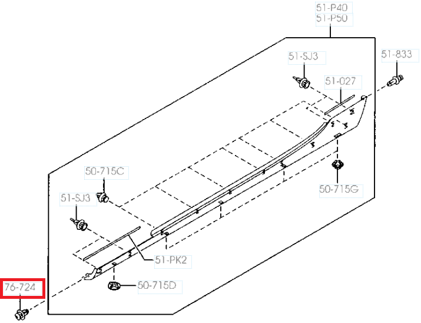
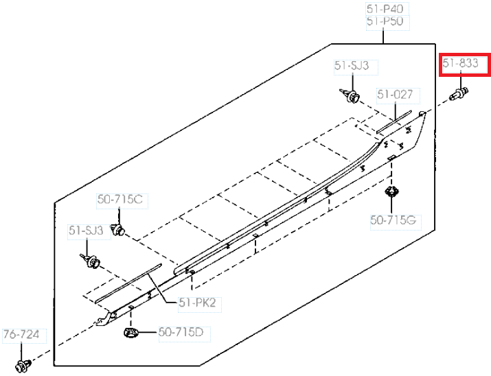
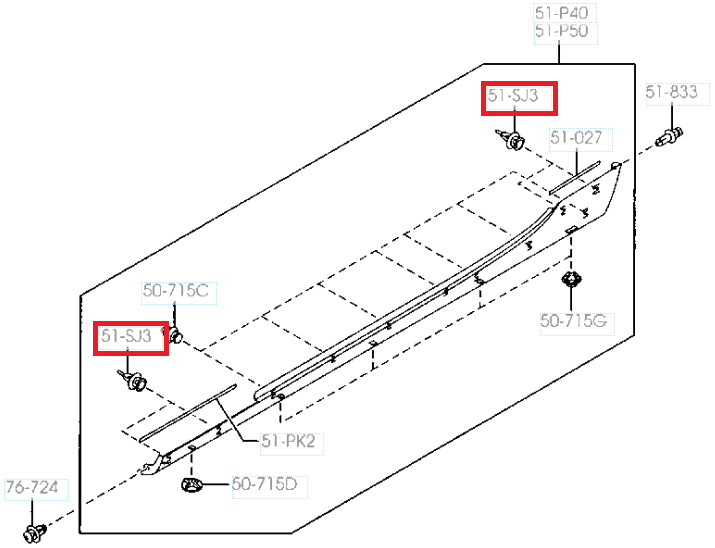
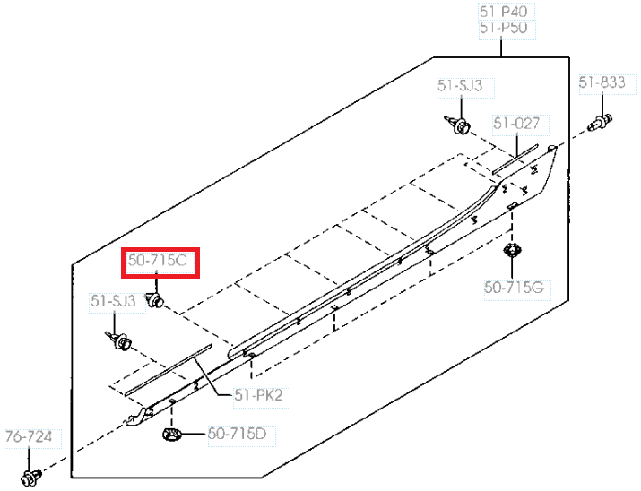
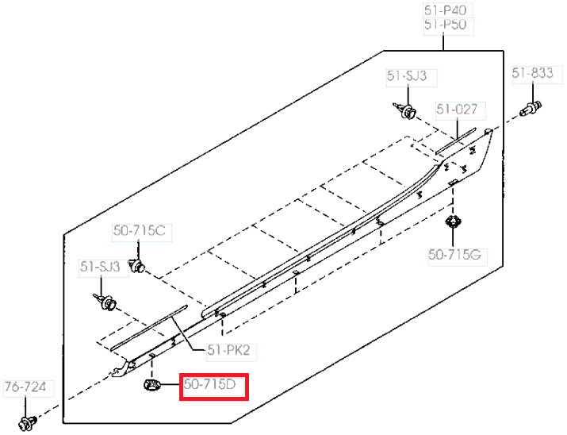
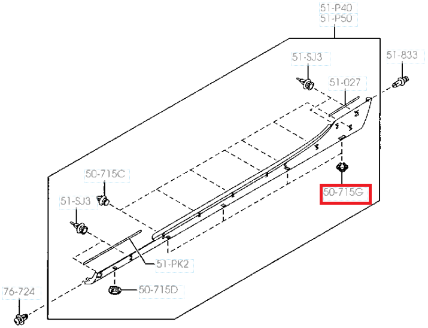
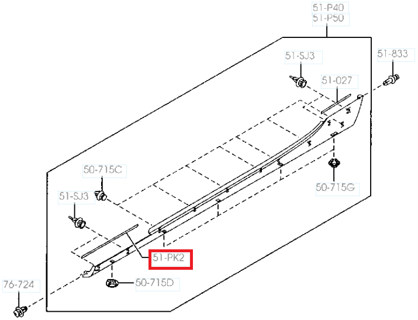
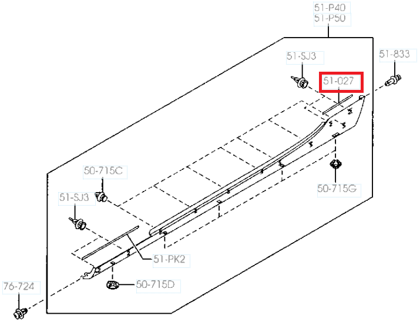

## Правая

`NHY251P40` 12

`NH5251P40D` 12

маркировка на внутренней стороне `NE5151P40`

## Левая

`NHY251P50` 12

`NH5251P50D` 12

маркировка на внутренней стороне `NE5151P50`

## Клипса `B09251833` (с торца в передней части)

1 шт на одну сторону

__Zekkert__ `BE2191`

## Клипса `S51S51833` (с торца в задней части)

1 шт на одну сторону

__Masuma__ `KJ1723`

## Клипса `G18K51SJ3`

4 шт на одну сторону

__Masuma__ `KJ1748`

## Клипса `NE5151SJ3A`

7 шт на одну сторону

__Patron__ `P370161`

__Zekkert__ `BE2503`

## Клипса `NE5551SJ3A`

1 шт на одну сторону

Неоправданно дорого, долгая доставка

Альтернативный партномер: __Mazda__ `G22C51SJ3` (~150 руб, быстрая доставка)

Аналоги (~50 руб, быстрая доставка):

- __Zekkert__ `BE3634`
- __Patron__ `P372383`
- __Masuma__ `KJ2700`
- __Avers__ `G22C51SJ3AV`
- __Auto-GUR__ `AGA1369`

## Клипса `NE5651SJ3A`

4 шт на одну сторону

__Mazda__ `BP4L51SJ3`

__Auto-GUR__ `AGA204`

## Protector `NH5251RC2`

1 шт на одну сторону

## Protector `NH5251RE2`

1 шт на одну сторону

