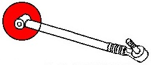
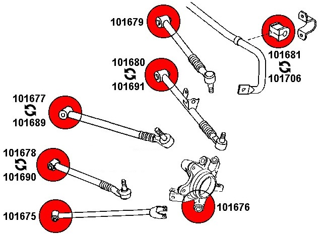

## Передняя ось

### Рычаги

Если от RX-8, то передние верхние только рест

| Деталь | Партномер |
|:-:|:-:|
| Рычаг нижний правый | `NE5134300C` `NE5134300D` |
| Рычаг нижний левый | `NE5134350C` `NE5134350D` |
| Рычаг верхний правый | `NE5134200B` `NH4234200` |
| Рычаг верхний левый | `NE5134350C` `NE5134350D` |

## Задняя ось

### Рычаги

Если от RX-8, то задние развальные только рест

| № на фото | Деталь | Изображение на схеме |
|:-:|:-:|:-:|
| 1, 10 | Рычаги верхние передние |  |

| № на фото | Деталь | Партномер | Маркировка на обойме сайлентблока | Длина, см |
|:-:|:-:|:-:|:-:|:-:|
| 1 | Рычаг верхний передний левый | `NE5128D10B` | `1C15` | 34 |
| 10 | Рычаг верхний передний правый | `NE5128D00B` | `1C15` | 34 |
| 2 | Рычаг верхний задний левый | `NE5128650B` | `1B16` | 34 |
| 9 | Рычаг верхний задний правый | `NE5128600B` | `1B16` | 34 |
| 3, 8 | Тяга регулировки схождения | `NE512845XA` `NE512845XB` | `1C15T` | 37 |
| 4, 7 | Рычаг нижний продольный | `NE5128200A` | `1B24` | 42 |
| 5 | Рычаг регулировки развала левый  | `N12128550B` `NE5128550B` | `BF30` | 58 |
| 6 | Рычаг регулировки развала правый | `NE5128500B` | `8F27` | 58 |

### Пыльники

| № рычага на фото | Пыльник (партномер / маркировка) | Сайлентблок (марка, модель / маркировка обоймы)
|:-:|:-:|:-:|
| 1, 10 | `F151284B3` `ER0830M0` `BDC200A` | __Strongflex__ `101689` __Strongflex__ `101677` ***(RX-8)*** |
| 2, 9 | `F15128503` `ER0831M0` `BDC201A` | __Strongflex__ `101679` |
| 3, 8 | `F151284A3` `BDC174A` | __Strongflex__ `101690` __Strongflex__ `101678` ***(RX-8)*** |
| 4, 7 | отсутствует | __Strongflex__ `101675` |
| 5, 6 | `F15128503` `ER0831M0` `BDC201A` | __Strongflex__ `101691` __Strongflex__ `101680` ***(RX-8)*** |

### Сайлентблоки

| № рычага на фото | Пыльник (партномер / маркировка) | Сайлентблок (марка, модель / маркировка обоймы)
|:-:|:-:|:-:|
| 1, 10 | `F151284B3` `ER0830M0` `BDC200A` | __Strongflex__ `101689` __Strongflex__ `101677` ***(RX-8)*** |
| 2, 9 | `F15128503` `ER0831M0` `BDC201A` | __Strongflex__ `101679` |
| 3, 8 | `F151284A3` `BDC174A` | __Strongflex__ `101690` __Strongflex__ `101678` ***(RX-8)*** |
| 4, 7 | отсутствует | __Strongflex__ `101675` |
| 5, 6 | `F15128503` `ER0831M0` `BDC201A` | __Strongflex__ `101691` __Strongflex__ `101680` ***(RX-8)*** |