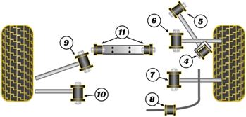

## Передняя ось

Если от RX-8, то передние верхние только рест

| Наименование | Партномер |
|:-:|:-:|
| Рычаг нижний правый | `NE5134300C` `NE5134300D` |
| Рычаг нижний левый | `NE5134350C` `NE5134350D` |
| Рычаг верхний правый | `NE5134200B` `NH4234200` |
| Рычаг верхний левый | `NE5134350C` `NE5134350D` |

## Задняя ось

Если от RX-8, то задние развальные только рест

| № на фото (L, R) | Наименование | Изображение на схеме | Партномер | Маркировка на обойме сайлентблока | Длина, см |
|:-:|:-:|:-:|:-:|:-:|:-:|
| 1, 10 | Рычаги верхние передние |  | `NE5128D10B` __(L)__ `NE5128D00B` __(R)__ | `1C15` | 34 |
| 2, 9 | Рычаги верхние задние |  | `NE5128650B` __(L)__ `NE5128600B` __(R)__ | `1B16` | 34 |
| 3, 8 | Тяги регулировки схождения |  | `NE512845XA` `NE512845XB` (разные ревизии, __L__ и __R__ одинаковые) | `1C15T` | 37 |
| 4, 7 | Рычаги нижние продольные |  | `NE5128200A` | `1B24` | 42 |
| 5, 6 | Рычаги регулировки развала |  | `N12128550B` __(L)__ `NE5128550B` __(L)__ `NE5128500B` __(R)__ | `BF30` __(L)__ `8F27` __(R)__ | 58 |

### Пыльники

| № рычага на фото | Партномер | Маркировка |
|:-:|:-:|:-:|
| 1, 10 | `F151284B3` | `ER0830M0` `BDC200A` |
| 2, 5, 6, 9 | `F15128503` | `ER0831M0` `BDC201A` |
| 3, 8 | `F151284A3` | `BDC174A` |

### Сайлентблоки

| № рычага на фото | Партномер |
|:-:|:-:|
| 1, 10 | __Strongflex__ `101689` __Strongflex__ `101677` ***(RX-8)*** |
| 2, 9 | __Strongflex__ `101679` |
| 3, 8 | __Strongflex__ `101690` __Strongflex__ `101678` ***(RX-8)*** |
| 4, 7 | __Strongflex__ `101675` |
| 5, 6 | __Strongflex__ `101691` __Strongflex__ `101680` ***(RX-8)*** |

### Сайлентблоки *Powerflex*

| На схеме | Рычаг | Партномер | Ссылка |
|:-:|:-:|:-:|:-:|
| 4 | Рычаг задний | `PFR36404BLK` | https://powerflex.ru/parts/POWERFLEX/PFR36404BLK |
| 5 | Рычаг передний | `PFR36405BLK` | https://powerflex.ru/parts/POWERFLEX/PFR36405BLK |
| 6 | Тяга поперечная | `PFR36406BLK` | https://powerflex.ru/parts/POWERFLEX/PFR36406BLK |
| 7 | Кронштейн связующий внутренний | `PFR36407BLK` | https://powerflex.ru/parts/POWERFLEX/PFR36407BLK |
| 9 | Кронштейн верхний передний соединительный | `PFR36409BLK` | https://powerflex.ru/parts/POWERFLEX/PFR36409BLK |
| 10 | Кронштейн задний верхний | `PFR36410BLK` | https://powerflex.ru/parts/POWERFLEX/PFR36410BLK |