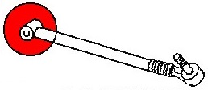

Если от RX-8, то развальные только рест

| № на фото (L, R) | Наименование | Изображение на схеме | Партномер | Маркировка на обойме сайлентблока | Длина, см |
|:-:|:-:|:-:|:-:|:-:|:-:|
| 1, 10 | Рычаги верхние передние |  | `NE5128D10B` __(L)__ `NE5128D00B` __(R)__ | `1C15` | 34 |
| 2, 9 | Рычаги верхние задние |  | `NE5128650B` __(L)__ `NE5128600B` __(R)__ | `1B16` | 34 |
| 3, 8 | Тяги регулировки схождения |  | `NE512845XA` `NE512845XB` (разные ревизии, __L__ и __R__ одинаковые) | `1C15T` | 37 |
| 4, 7 | Рычаги нижние продольные |  | `NE5128200A` | `1B24` | 42 |
| 5, 6 | Рычаги регулировки развала |  | `N12128550B` __(L)__ `NE5128550B` __(L)__ `NE5128500B` __(R)__ | `BF30` __(L)__ `8F27` __(R)__ | 58 |

## Пыльники

| № рычага на фото | Партномер | Маркировка | Диаметр основания, мм | Диаметр отверстия, мм | Высота, мм |
|:-:|:-:|:-:|:-:|:-:|:-:|
| 1, 10 | `F151284B3` | `ER0830M0` `BDC200A` | 40 | 16 | 22 |
| 2, 9, 5, 6 | `F15128503` | `ER0831M0` `BDC201A` | 49/48 | 18/13 | 30/34 |
| 3, 8 | `F151284A3` | `BDC174A` | 37 | 23 | 20 |

## Размеры сайлентблоков

| № рычага на фото | Внутренний диаметр втулки, мм | Наружный диаметр втулки, мм | Ширина втулки, мм | Ширина обоймы, мм | Диаметр обоймы, мм |
|:-:|:-:|:-:|:-:|:-:|:-:|
| 1, 10 | 12 | 20 | 47-48 | 35 | 32 |
| 2, 9 | 12 | 20 | 55 | 45 | 40 |
| 3, 8 | 12 | от 23 к 28 | 47 | 31 | 35 |
| 4, 7 | 12 | 20 | 47-48 | 35 | 29-30 |
| 5, 6 | 14 | 27 | 60 | 50 | 34 |

## Сайлентблоки

| № рычага на фото | Партномер |
|:-:|:-:|
| 1, 10 | __Strongflex__ `101689` __Strongflex__ `101677` ***(RX-8)*** |
| 2, 9 | __Strongflex__ `101679` |
| 3, 8 | __Strongflex__ `101690` __Strongflex__ `101678` ***(RX-8)*** |
| 4, 7 | __Strongflex__ `101675` |
| 5, 6 | __Strongflex__ `101691` __Strongflex__ `101680` ***(RX-8)*** |

## Сайлентблоки *Powerflex*

| На схеме | Наименование | Партномер | Ссылка |
|:-:|:-:|:-:|:-:|
| 4 | Задняя втулка рычага | `PFR36404BLK` | https://powerflex.ru/parts/POWERFLEX/PFR36404BLK |
| 5 | Втулка верхнего рычага | `PFR36405BLK` | https://powerflex.ru/parts/POWERFLEX/PFR36405BLK |
| 6 | Втулка тяги | `PFR36406BLK` | https://powerflex.ru/parts/POWERFLEX/PFR36406BLK |
| 7 | Втулка заднего рычага | `PFR36407BLK` | https://powerflex.ru/parts/POWERFLEX/PFR36407BLK |
| 9 | Внутренняя втулка кронштейна | `PFR36409BLK` | https://powerflex.ru/parts/POWERFLEX/PFR36409BLK |
| 10 | Внутренняя втулка кронштейна | `PFR36410BLK` | https://powerflex.ru/parts/POWERFLEX/PFR36410BLK |