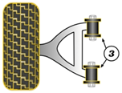

Если от RX-8, то только рест (отличается длина резьбы на шаровой опоре)

## Правый

__Mazda__ `NE5134200B`

__Mazda__ `NH4234200`

## Левый

__Mazda__ `NE5134350C`

__Mazda__ `NE5134350D`

## Сайлентблоки

__VTR__ `MZ0115R`

https://vtr.su/mz0115r

OEM:

- `F15134200B`
- `F15134250B`

__Strongflex__ `101674`

__Powerflex__ `PFF36403BLK` https://powerflex.ru/parts/POWERFLEX/PFF36403BLK

__X5 Resource__ `280177`

- https://www.x5online.ru/catalog/x5_resource/28_0177_black_saylentblok_verkhnego_rychaga_peredney_podveski/
- https://www.x5online.ru/catalog/x5_resource/28_0177_saylentblok_verkhnego_rychaga_peredney_podveski/

OEM:

- `F15134200B`
- `F15134250B`