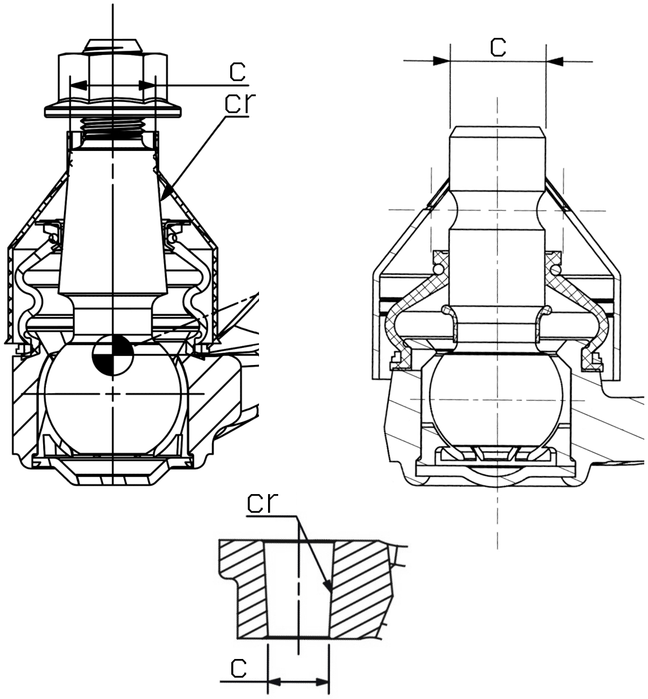

Если от RX-8, то только рест (отличается длина резьбы на шаровой опоре)

`c` = 14.2

`cr` = 1/8

## Правый

__Mazda__ `NE5134200B`

__Mazda__ `NH4234200`

__Mazda__ `F19034200`

__Sidem__ `51573` (OEM `NE5134200B`, `NH4234200`, `F19034200`)

https://catalogue.sidem.be/ru/tovar/%D1%80%D1%8B%D1%87%D0%B0%D0%B3-%D0%BF%D0%BE%D0%B4%D0%B2%D0%B5%D1%81%D0%BA%D0%B8-%D0%BF%D1%80%D0%B0%D0%B2%D1%8B%D0%B9-%D1%81-%D1%88%D0%B0%D1%80%D0%BE%D0%B2%D0%BE%D0%B9-%D0%BE%D0%BF%D0%BE%D1%80%D0%BE%D0%B9-159868

## Левый

__Mazda__ `NE5134350C`

__Mazda__ `NE5134350D`

__Mazda__ `NE5134250B`

__Mazda__ `NH4234250`

__Mazda__ `F19034250`

__Sidem__ `51572` (OEM `NE5134250B`, `NH4234250`, `F19034250`)

https://catalogue.sidem.be/ru/tovar/%D1%80%D1%8B%D1%87%D0%B0%D0%B3-%D0%BF%D0%BE%D0%B4%D0%B2%D0%B5%D1%81%D0%BA%D0%B8-%D0%BB%D0%B5%D0%B2%D1%8B%D0%B9-%D1%81-%D1%88%D0%B0%D1%80%D0%BE%D0%B2%D0%BE%D0%B9-%D0%BE%D0%BF%D0%BE%D1%80%D0%BE%D0%B9-159867