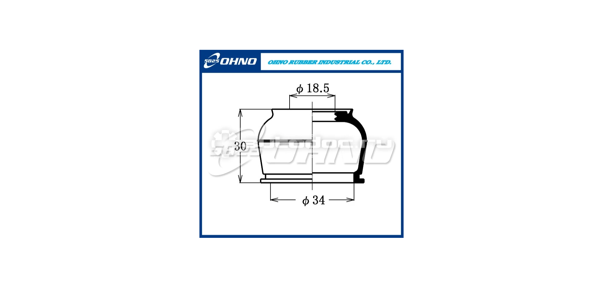
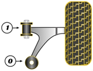

## Правый

__Mazda__ `NE5134300C`

__Mazda__ `NE5134300D`

## Левый

__Mazda__ `NE5134350C`

__Mazda__ `NE5134350D`

## Пыльник шаровой опоры

19 x 38 x 30

__Masuma__ `MO2108`

__OHNO__ `DC1304`

## Сайлентблоки

## Сайлентблок под стойку

__Mazda__ `F15134710`

__Strongflex__ `101673`

__X5 Resource__ `280187`

https://www.x5online.ru/catalog/x5_resource/28_0187_saylentblok_nizhnego_rychaga_peredney_podveski_pod_stoyku/

OEM:

- `F15134710`
- `F18934300`
- `F18934300A`
- `F18934350`
- `F18934350A`
- `F15134300`
- `F15134300A`
- `F15134350`
- `F15134350A`

### Задний сайлентблок (0)

На правый рычаг:

- __Mazda__ `NE5134450`
- __Sidem__ `851635`

На левый рычаг:

- __Mazda__ `NE5134460`
- __Sidem__ `851634`

__Mazda__ `F15134460`

__Mitsubishi__ `MB109684`

__VTR__ `MZ0116R` https://vtr.su/mz0116r OEM: `F15134460`

__RBI__ `M2445WS`

__Strongflex__ `101672`

__Powerflex__ `PFF36400BLK` https://www.powerflex.ru/parts/POWERFLEX/PFF36400BLK

__X5 Resource__ `280164`

- https://www.x5online.ru/catalog/x5_resource/28_0164_black_saylentblok_nizhnego_rychaga_peredney_podveski_zadniy/
- https://www.x5online.ru/catalog/x5_resource/28_0164_saylentblok_nizhnego_rychaga_peredney_podveski_zadniy/

OEM:

- `F15134460`
- `F18934460`
- `F15134300`
- `F15134300A`
- `F15134350`
- `F15134350A`
- `F18934300`
- `F18934300A`
- `F18934350`
- `F18934350A`

### Передний сайлентблок (1)

__Mazda__ `F15134470`

__Mazda__ `F18934470`

__VTR__ `MZ0114R`

https://vtr.su/mz0114r

OEM:

- `F15134470`
- `F18934470`

__Strongflex__ `101671`

__Powerflex__ `PFF36401BLK` https://powerflex.ru/parts/POWERFLEX/PFF36401BLK

__X5 Resource__ `280162`

https://www.x5online.ru/catalog/x5_resource/28_0162_saylentblok_nizhnego_rychaga_peredney_podveski_peredniy/

OEM:

- `F18934470`
- `F15134470`
- `F15134300`
- `F15134300A`
- `F15134350`
- `F15134350A`
- `F18934300`
- `F18934300A`
- `F18934350`
- `F18934350A`