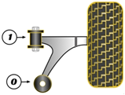

На схеме - 0

На правый рычаг:

- __Mazda__ `NE5134450`
- __Sidem__ `851635`

На левый рычаг:

- __Mazda__ `NE5134460`
- __Sidem__ `851634`

__Mitsubishi__ `MB109684`

__VTR__ `MZ0116R` https://vtr.su/mz0116r

__RBI__ `M2445WS`

__Strongflex__ `101672`

__Powerflex__ `PFF36400BLK` https://www.powerflex.ru/parts/POWERFLEX/PFF36400BLK

__X5 Resource__ `280164`

- https://www.x5online.ru/catalog/x5_resource/28_0164_black_saylentblok_nizhnego_rychaga_peredney_podveski_zadniy/
- https://www.x5online.ru/catalog/x5_resource/28_0164_saylentblok_nizhnego_rychaga_peredney_podveski_zadniy/

Кроссы с другими партномерами __Mazda__:

- `F15134460`
- `F18934460`
- `F15134350`
- `F15134350A`
- `F18934300`
- `F18934300A`
- `F18934350`
- `F18934350A`