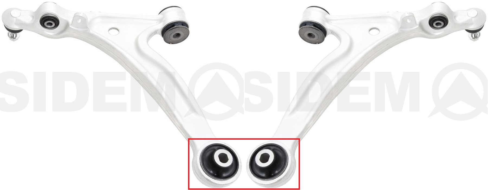
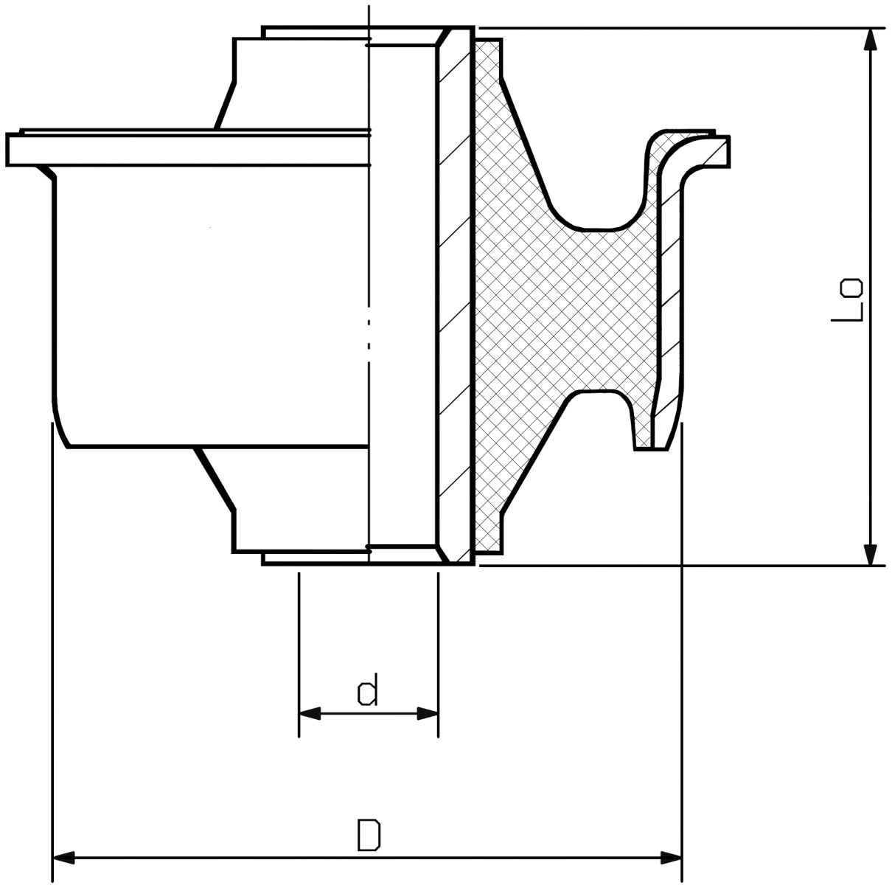
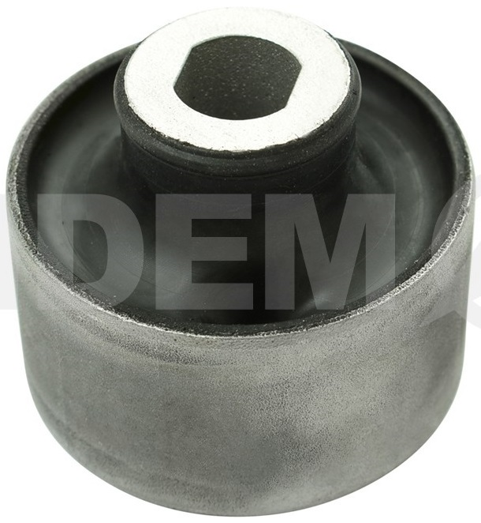
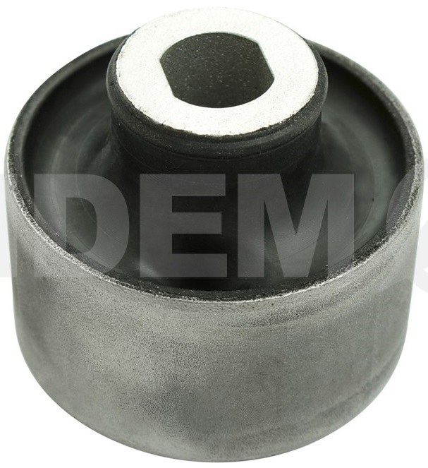

`di` = 16.3

`dp` = 60.8

`Lo` = 60

На правый рычаг:

- __Mazda__ `NE5134450`
- __Sidem__ `851635`

https://catalogue.sidem.be/ru/tovar/%D1%81%D0%B0%D0%B9%D0%BB%D0%B5%D0%BD%D1%82%D0%B1%D0%BB%D0%BE%D0%BA-%D0%B4%D0%BB%D1%8F-%D1%80%D1%8B%D1%87%D0%B0%D0%B3%D0%B0-%D0%BF%D0%BE%D0%B4%D0%B2%D0%B5%D1%81%D0%BA%D0%B8-159875

На левый рычаг:

- __Mazda__ `NE5134460`
- __Sidem__ `851634`

https://catalogue.sidem.be/ru/tovar/%D1%81%D0%B0%D0%B9%D0%BB%D0%B5%D0%BD%D1%82%D0%B1%D0%BB%D0%BE%D0%BA-%D0%B4%D0%BB%D1%8F-%D1%80%D1%8B%D1%87%D0%B0%D0%B3%D0%B0-%D0%BF%D0%BE%D0%B4%D0%B2%D0%B5%D1%81%D0%BA%D0%B8-159874

__Mitsubishi__ `MB109684`

__VTR__ `MZ0116R` https://vtr.su/mz0116r

__RBI__ `M2445WS`

__Strongflex__ `101672`

__Powerflex__ `PFF36400BLK` https://www.powerflex.ru/parts/POWERFLEX/PFF36400BLK

__X5 Resource__ `280164`

- https://www.x5online.ru/catalog/x5_resource/28_0164_black_saylentblok_nizhnego_rychaga_peredney_podveski_zadniy/
- https://www.x5online.ru/catalog/x5_resource/28_0164_saylentblok_nizhnego_rychaga_peredney_podveski_zadniy/

Кроссы с другими партномерами __Mazda__:

- `F15134460`
- `F18934460`