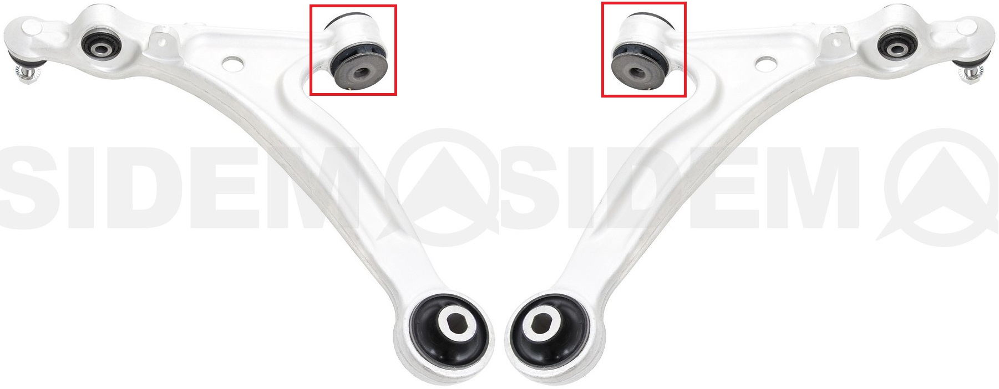
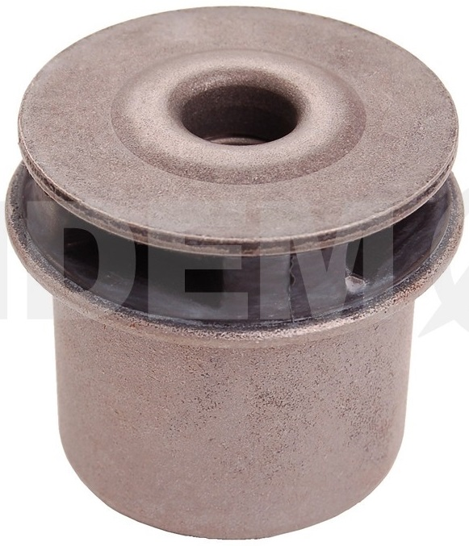

`di` = 14.1

`dp` = 47.6

`Lo` = 60

__Mazda__ `F15134470`

__Mazda__ `F18934470`

__VTR__ `MZ0114R`

https://vtr.su/mz0114r

__Sidem__ `851636`

https://catalogue.sidem.be/ru/tovar/%D1%81%D0%B0%D0%B9%D0%BB%D0%B5%D0%BD%D1%82%D0%B1%D0%BB%D0%BE%D0%BA-%D0%B4%D0%BB%D1%8F-%D1%80%D1%8B%D1%87%D0%B0%D0%B3%D0%B0-%D0%BF%D0%BE%D0%B4%D0%B2%D0%B5%D1%81%D0%BA%D0%B8-159876

__Strongflex__ `101671`

__Powerflex__ `PFF36401BLK` https://powerflex.ru/parts/POWERFLEX/PFF36401BLK

__X5 Resource__ `280162`

https://www.x5online.ru/catalog/x5_resource/28_0162_saylentblok_nizhnego_rychaga_peredney_podveski_peredniy/

OEM:

- `F18934470`
- `F15134470`
- `F15134300`
- `F15134300A`
- `F15134350`
- `F15134350A`
- `F18934300`
- `F18934300A`
- `F18934350`
- `F18934350A`