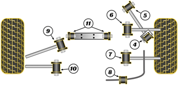

## Задняя ось

| На схеме | Деталь | Наименование | Кол-во |
|:-:|:-:|:-:|:-:|
| 4 | Рычаг продольный | Задний сайлентблок | 2 |
| 5 | Рычаг продольный | Передний сайлентблок | 2 |
| 6 | Тяга поперечная | Сайлентблок | 2 |
| 7 | Кронштейн связующий внутренний | Сайлентблок | 2 |
| 8 | Стабилизатор | Втулка | 2 |
| 9 | Кронштейн верхний передний соединительный | Сайлентблок | 2 |
| 10 | Кронштейн задний верхний | Сайлентблок | 2 |
| 11 | Кронштейн редуктора | Сайлентблок | 2 |