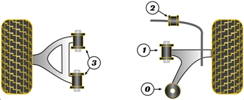

## Передняя ось

| На схеме | Деталь | Наименование | Кол-во |
|:-:|:-:|:-:|:-:|
| 0 | Рычаг нижний | Задний сайлентблок | 2 |
| 1 | Рычаг нижний | Передний сайлентблок | 2 |
| 2 | Стабилизатор | Втулка | 2 |
| 3 | Рычаг верхний | Сайлентблок | 4 |

### Пыльник шаровой опоры переднего нижнего рычага

19 x 38 x 30

__Masuma__ `MO2108`

### Сайлентблоки переднего нижнего рычага

Под стойку __X5 Resource__ `280187`

Передний __VTR__ `MZ0114R`

__Sidem__ `851634`

__Sidem__ `851635`