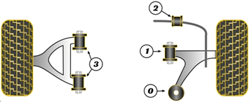

## Передняя ось

| На схеме | Деталь | Наименование | Кол-во |
|:-:|:-:|:-:|:-:|
| 0 | Рычаг нижний | Задний сайлентблок | 2 |
| 1 | Рычаг нижний | Передний сайлентблок | 2 |
| 2 | Стабилизатор | Втулка | 2 |
| 3 | Рычаг верхний | Сайлентблок | 4 |

### Пыльник шаровой опоры переднего нижнего рычага

__Masuma__ `MO2130` ***непроверенная инфа***