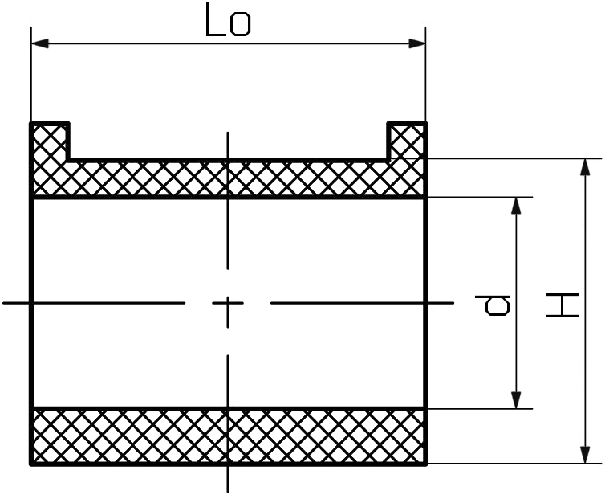

## Втулки заднего стабилизатора

__Mazda__ `NF5328151C`

__Mazda__ `NE5128151A`

__Mazda__ `N02328156` ***заказывал на zzap***

__Mazda__ `NF5328156B`

__Mazda__ `G11328156`

__BORG & BECK__ `BSK7326K`

__Mazda__ `FE8728156` ***RX-8***

__Strongflex__ `101681`

__Strongflex__ `101706`

__Powerflex__ `PFR3640812BLK`

__Jikiu__ `BL25007`

__Точка Опоры__ `4011142`

__Точка Опоры__ `4011143`

__Sidem__ `851903` (OEM `N02328156`):

- `di` = 10.5
- `dp` = 29
- `Lo` = 32
- `H` = 30.5

__Sidem__ `851902` (OEM `G11328156`, `NF5328156B`):

- `di` = 11.5
- `dp` = 29
- `Lo` = 32