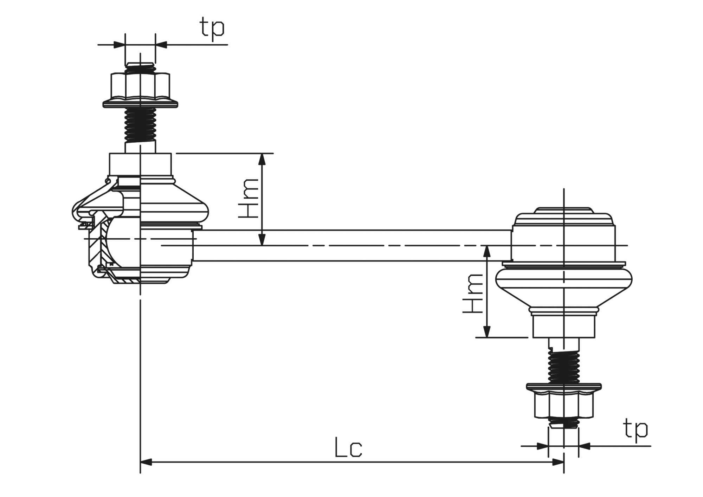

| Производитель | Правая | Левая |
|:-:|:-:|:-:|
| __Mazda__ | `F18934150` | `F18934170` |
| __Mazda__ | `GA2A34150A` | `GA2A34170A` |
| __Hyundai/Kia__ | `KGA2A34150B` | `KGA2A34170B` |
| __Нет Износа__ | `NL049B` | `NL049A` |
| __CTR__ | `CLMZ23` | `CLMZ24` |
| __CTR__ | `CL0323R` | `CL0323L` |
| __Lemforder__ | `2493801` | `2303901` |
| __555__ | `SL1610R` | `SL1610L` |
| __VTR__ | `FO2901S` | `FO2801S` |
| __Sidem__ | `51061` | `51060` |

`Lc` = 105

`tp` = MM10x1.5R

## Правая

https://catalogue.sidem.be/ru/tovar/%D1%81%D1%82%D0%BE%D0%B9%D0%BA%D0%B0-%D1%81%D1%82%D0%B0%D0%B1%D0%B8%D0%BB%D0%B8%D0%B7%D0%B0%D1%82%D0%BE%D1%80%D0%B0-%D0%BF%D1%80%D0%B0%D0%B2%D0%B0%D1%8F-1888

Подходят от:

- Kia Clarus (K9A)
- Kia Clarus Estate (GC)
- Mazda 323 V (BA)
- Mazda 626 IV (GE)
- Mazda 626 V (GF, GW)
- Mazda CX-7 (ER)
- Mazda MX-6 (GE6)
- Mazda Xedos 6 (CA)

OEM:

- `3410591`
- `F15134150`
- `F18934150`
- `GA2A34150A`
- `KGA2A34150`
- `KGA2A34150A`
- `KGA2A34150B`
- `L20634150A`

## Левая

https://catalogue.sidem.be/ru/tovar/%D1%81%D1%82%D0%BE%D0%B9%D0%BA%D0%B0-%D1%81%D1%82%D0%B0%D0%B1%D0%B8%D0%BB%D0%B8%D0%B7%D0%B0%D1%82%D0%BE%D1%80%D0%B0-%D0%BB%D0%B5%D0%B2%D0%B0%D1%8F-1887

Подходят от:

- Kia Clarus (K9A)
- Kia Clarus Estate (GC)
- Mazda 323 V (BA)
- Mazda 626 IV (GE)
- Mazda 626 V (GF, GW)
- Mazda CX-7 (ER)
- Mazda MX-6 (GE6)
- Mazda Xedos 6 (CA)

OEM:

- `3410592`
- `F15134170`
- `F18934170`
- `GA2A34170A`
- `KGA2A34170`
- `KGA2A34170A`
- `KGA2A34170B`
- `L20634170A`