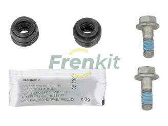
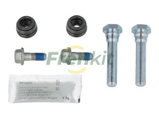
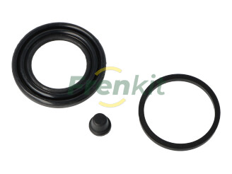
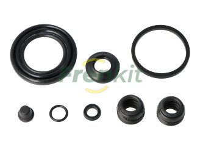
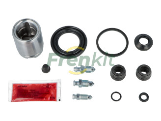
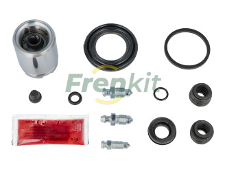
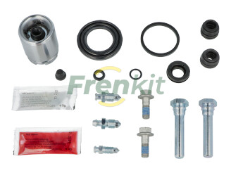
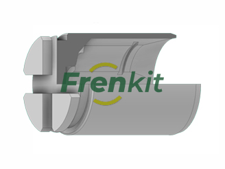
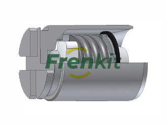
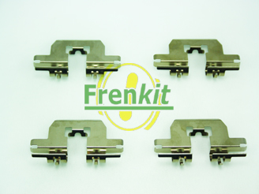

# Ремкомплекты задних суппортов и направляющих

https://www.frenkit.es/ru/katalog/catalogo-online/eu?marca=eu_64&modelo=eu_458965&ctipo=eu_2287885&stype=cats&type%5B%5D=38

## Guide basic kit

__Frenkit__ `810047`

https://www.frenkit.es/ru/katalog/catalogo-online/eu/810047

## Guide pin kit

__Frenkit__ `810079`

https://www.frenkit.es/ru/katalog/catalogo-online/eu/810079

## Caliper basic kit

__Frenkit__ `238120`

https://www.frenkit.es/ru/katalog/catalogo-online/eu/238120

## Caliper repair kit

__Frenkit__ `238025`

https://www.frenkit.es/ru/katalog/catalogo-online/eu/238025

## Caliper repair kit + piston

__Frenkit__ `238911`

https://www.frenkit.es/ru/katalog/catalogo-online/eu/238911

## Caliper repair kit + piston + mechanism

__Frenkit__ `238977`

https://www.frenkit.es/ru/katalog/catalogo-online/eu/238977

## Superkit

__Frenkit__ `738117`

https://www.frenkit.es/ru/katalog/catalogo-online/eu/738117

## Caliper piston

__Frenkit__ `P384701`

https://www.frenkit.es/ru/katalog/catalogo-online/eu/P384701

## Caliper piston + mechanism

__Frenkit__ `K384701`

https://www.frenkit.es/ru/katalog/catalogo-online/eu/K384701

## Pad clip kit

__Frenkit__ `901724`

https://www.frenkit.es/ru/katalog/catalogo-online/eu/901724