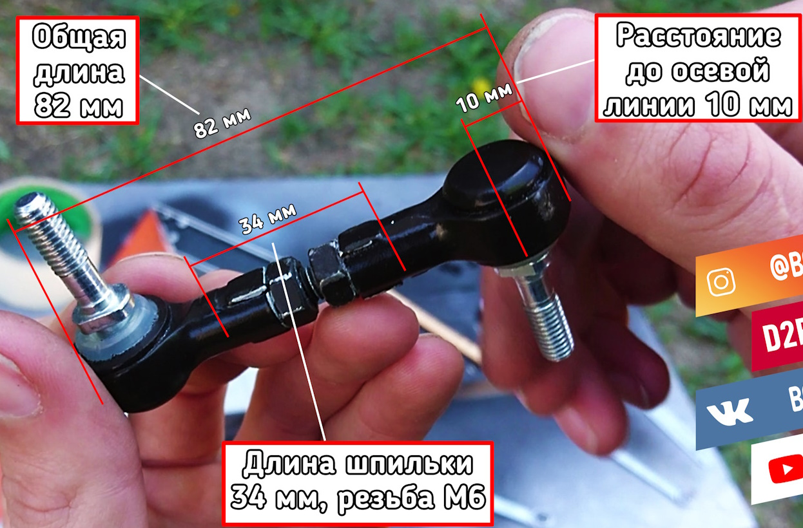

## Датчик корректора фар

Передний:

- __Mazda__ `NH545121Y`
- __Mazda__ `F1895121Y` ***RX-8***

Задний:

- __Mazda__ `NH545122Y`
- __Mazda__ `F1895122Y` ***RX-8***

__Mazda__ `NE855122YA`

__Toyota__ `8940548020`

__Toyota__ `8940648020`

__Toyota__ `8940760022`

__Toyota__ `8940860011`

__Auger__ `10593`

__Sampa__ `080124`

В сборе со шпилькой на примере Mazda 6:

## Тяга датчика корректора фар

__Toyota__ `4890635010`

__Toyota__`4890635020`

__Masuma__ `ML-002`