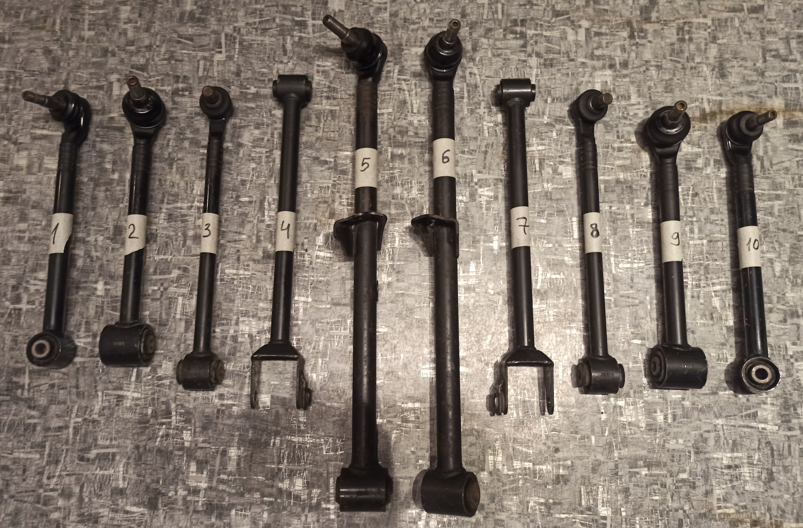
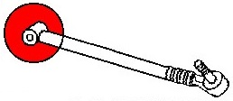
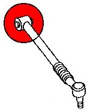
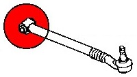
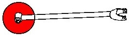
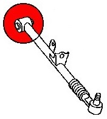
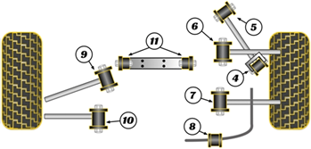

## Верхние передние рычаги / Trailing link top / 1 - левый, 10 - правый

Левый: __Mazda__ `NE5128D10B`

Правый: __Mazda__ `NE5128D00B`

Маркировка на обойме сайлентблока: `1C15`

Длина, см: 34

## Верхние задние рычаги / Rear top lateral link rear / 2 - левый, 9 - правый

Левый:

- __Mazda__ `NE5128650B`
- __Mazda__ `F18928650A` ***RX-8; резьба чуть короче, но закручивается***
- __Polcar__ `4526375K`
- __Moog__ `MDTC18530`

Правый:

- __Mazda__ `NE5128600B`
- __Mazda__ `F18928600A` ***RX-8; резьба чуть короче, но закручивается***
- __Polcar__ `4526385K`
- __Moog__ `MDTC18531`

Маркировка на обойме сайлентблока: `1B16`

Длина, см: 34

## Рычаги регулировки схождения / Toe link / 3 - левый, 8 - правый

Левый и правый одинаковые

- __Mazda__ `NE512845XA`
- __Mazda__ `NE512845XB`
- __Mazda__ `F1892845XA` ***RX-8***
- __Jakoparts__ `J4943046`

Маркировка на обойме сайлентблока: `1C15T`

Длина, см: 37

## Нижние продольные рычаги / Trailing link bottom / 4 - левый, 7 - правый

Левый и правый одинаковые

__Mazda__ `NE5128200A`

Маркировка на обойме сайлентблока: `1B24`

Длина, см: 42

## Рычаги регулировки развала / Rear bottom lateral link / 5 - левый, 6 - правый

Левый:

- __Mazda__ `N12128550B`
- __Mazda__ `NE5128550B`
- __Polcar__ `4526374K`
- __KYB__ `KSC5490`

Правый:

- __Mazda__ `NE5128500B`
- __Polcar__ `4526384K`
- __KYB__ `KSC5489`

***От RX-8 не подходят (длина та же, угол наклона шара другой); возможно, подойдут от реста***

Маркировка на обойме сайлентблока: `BF30` (L), `8F27` (R)

Длина, см: 58

## Пыльники

__Jikiu__ `CB23017` ***проверить, к каким подходит***

| № рычага на фото | Партномер | Маркировка | Диаметр основания, мм | Диаметр отверстия, мм | Высота, мм |
|:-:|:-:|:-:|:-:|:-:|:-:|
| 1, 10 | `F151284B3` | `ER0830M0` `BDC200A` | 40 | 16 | 22 |
| 2, 9, 5, 6 | `F15128503` | `ER0831M0` `BDC201A` | 49/48 | 18/13 | 30/34 |
| 3, 8 | `F151284A3` | `BDC174A` | 37 | 23 | 20 |

## Сайлентблоки

| № рычага на фото | Партномер |
|:-:|:-:|
| 1, 10 | __Strongflex__ `101689` __Strongflex__ `101677` ***(RX-8)*** |
| 2, 9 | __Strongflex__ `101679` |
| 3, 8 | __Strongflex__ `101690` __Strongflex__ `101678` ***(RX-8)*** |
| 4, 7 | __Strongflex__ `101675` |
| 5, 6 | __Strongflex__ `101691` __Strongflex__ `101680` ***(RX-8)*** __Mitsubishi__ `MB109684` __Febest__ `HAB-RES` Пыльник рулевого наконечника __ГАЗ__ `2217` |

## Сайлентблоки *Powerflex*

| На схеме | Наименование | Партномер | Ссылка |
|:-:|:-:|:-:|:-:|
| 4 | Задняя втулка рычага | `PFR36404BLK` | https://powerflex.ru/parts/POWERFLEX/PFR36404BLK |
| 5 | Втулка верхнего рычага | `PFR36405BLK` | https://powerflex.ru/parts/POWERFLEX/PFR36405BLK |
| 6 | Втулка тяги | `PFR36406BLK` | https://powerflex.ru/parts/POWERFLEX/PFR36406BLK |
| 7 | Втулка заднего рычага | `PFR36407BLK` | https://powerflex.ru/parts/POWERFLEX/PFR36407BLK |
| 9 | Внутренняя втулка кронштейна | `PFR36409BLK` | https://powerflex.ru/parts/POWERFLEX/PFR36409BLK |
| 10 | Внутренняя втулка кронштейна | `PFR36410BLK` | https://powerflex.ru/parts/POWERFLEX/PFR36410BLK |

## Размеры сайлентблоков

| № рычага на фото | Внутренний диаметр втулки, мм | Наружный диаметр втулки, мм | Ширина втулки, мм | Ширина обоймы, мм | Диаметр обоймы, мм |
|:-:|:-:|:-:|:-:|:-:|:-:|
| 1, 10 | 12 | 20 | 47-48 | 35 | 32 |
| 2, 9 | 12 | 20 | 55 | 45 | 40 |
| 3, 8 | 12 | от 23 к 28 | 47 | 31 | 35 |
| 4, 7 | 12 | 20 | 47-48 | 35 | 29-30 |
| 5, 6 | 14 | 27 | 60 | 50 | 34 |