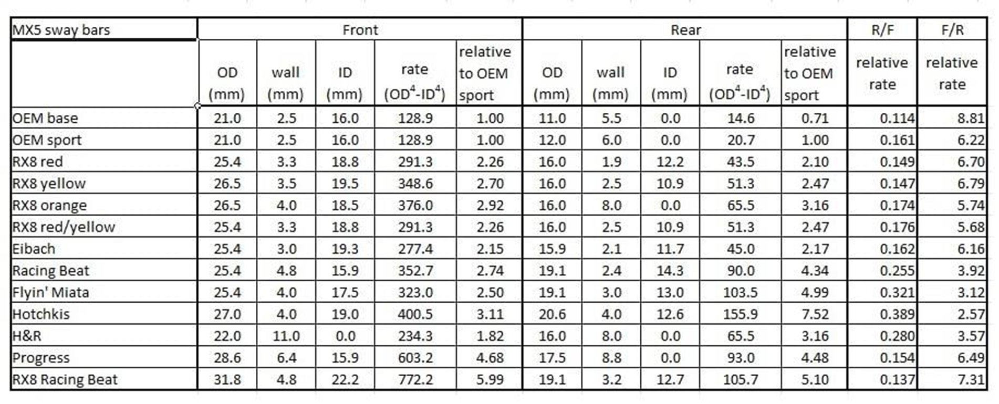

## Сравнение стабилизаторов

base – АКПП, sport – МКПП

Красный перед, жёлтый зад

A yellow front and orange rear will give you much more "bar" while keeping balance close to stock, a little more oversteer