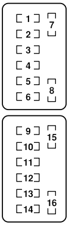
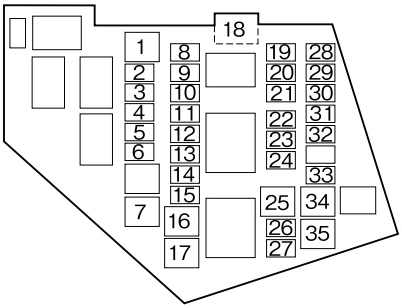

## В салоне

__Mini (APM/ATM)__

| № | Обозначение | Номинальный ток, А | Защищаемый потребитель электроэнергии |
|:-:|:-:|:-:|:-:|
| 1 | `ACC` | 7.5 | Аудиосистема Регулировка зеркал |
| 2 | `AUX PWR` | 15 | Прикуриватель |
| 3 | `METER` | 15 | Приборная панель |
| 4 | `SEAT WARM` | 20 | Подогрев сидений |
| 5 | `ILLUMI` | 7.5 | Подсветка панели управления |
| 6 | `A/C` | 7.5 | Кондиционер |
| 7 | `ENGINE` | 7.5 | Управление двигателем Различные цепи |
| 8 | - | - | - |
| 9 | `M. DEF` | 7.5 | Обогрев зеркал |
| 10 | `AUDIO` | 20 | Аудиосистема |
| 11 | `D. LOCK` | 20 | Центральный замок Привод крышки багажника |
| 12 | `SILEN` | 7.5 | Сигнализация |
| 13 | - | - | - |
| 14 | - | - | - |
| 15 | - | - | - |
| 16 | - | - | - |

## В моторном отсеке

__Low profile mini (APS)__

| № | Обозначение | Номинальный ток, А | Защищаемый потребитель электроэнергии |
|:-:|:-:|:-:|:-:|
| 1 | `FAN` | 30 | Вентилятор |
| 2 | `FAN` | 7.5 | Вентилятор |
| 3 | `DEFOG` | 20 | Обогрев заднего стекла |
| 4 | `H/CLEAN` | 20 | - |
| 5 | `ROOM` | 15 | Плафон в салоне Плафон в багажнике |
| 6 | `IG KEY 2` | 15 | Различные цепи |
| 7 | `HEATER` | 40 | Кондиционер |
| 8 | `ABS` | 30 | АБС |
| 9 | `FOG` | 15 | Противотуманные фары |
| 10 | `R. FOG` | 7.5 | - |
| 11 | `RHT L` | 30 | Левый мотор крыши |
| 12 | `RHT R` | 30 | Правый мотор крыши |
| 13 | `MAG` | 7.5 | Кондиционер |
| 14 | `ST` | 20 | Стартер |
| 15 | `TAIL` | 15 | Задние фонари Габаритные огни Подсветка номера |
| 16 | `ABS` | 40 | АБС |
| 17 | `BTN` | 30 | Различные цепи |
| 18 | `MAIN` | 120 | Все цепи |
| 19 | `ECU INJ` | 10 | Впрыск топлива |
| 20 | `EGI COMP1` | 10 | Управление двигателем |
| 21 | `EGI COMP2` | 10 | Управление двигателем |
| 22 | `HEAD LOW L` | 15 | Ближний свет (левая фара) |
| 23 | `HEAD LOW R` | 15 | Ближний свет (правая фара) |
| 24 | `HEAD` | 15 | Дальний свет |
| 25 | `P. WIND` | 20 | Стеклоподъёмники |
| 26 | `ENGINE` | 15 | Управление двигателем |
| 27 | `WIPER` | 20 | Щетки стеклоочистителя и моторчик омывателя |
| 28 | `DRL` | 15 | ДХО |
| 29 | `HORN` | 15 | Сигнал |
| 30 | `STOP` | 10 | Стоп-сигналы |
| 31 | `ETV` | 10 | Дроссельная заслонка |
| 32 | `FUEL PUMP` | 15 | Топливный насос |
| 33 | `HAZARD` | 10 | Указатели поворота |
| 34 | `P. WIND 2` | 20 | Стеклоподъёмники |
| 35 | `IG KEY 1` | 40 | Различные цепи |